# Instruction "How to create API client"

## Create a new Project

After succes registration on `Commerce Tools` go [Merchant Center](https://mc.europe-west1.gcp.commercetools.com/) to section [Manage projects](https://mc.europe-west1.gcp.commercetools.com/account/projects) to create a new project
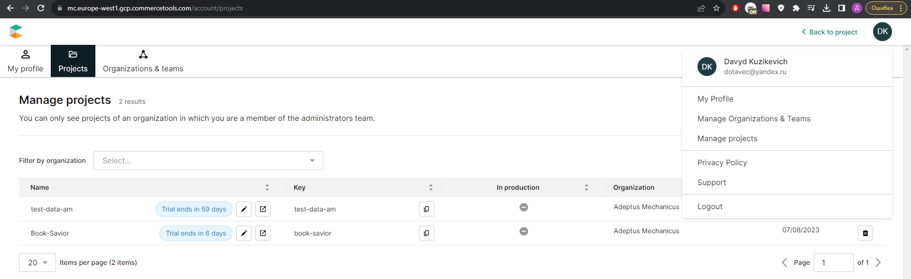

## Project Settings

After creating a new project in `Commerce Tools` go `Project settings` to tab page `International` 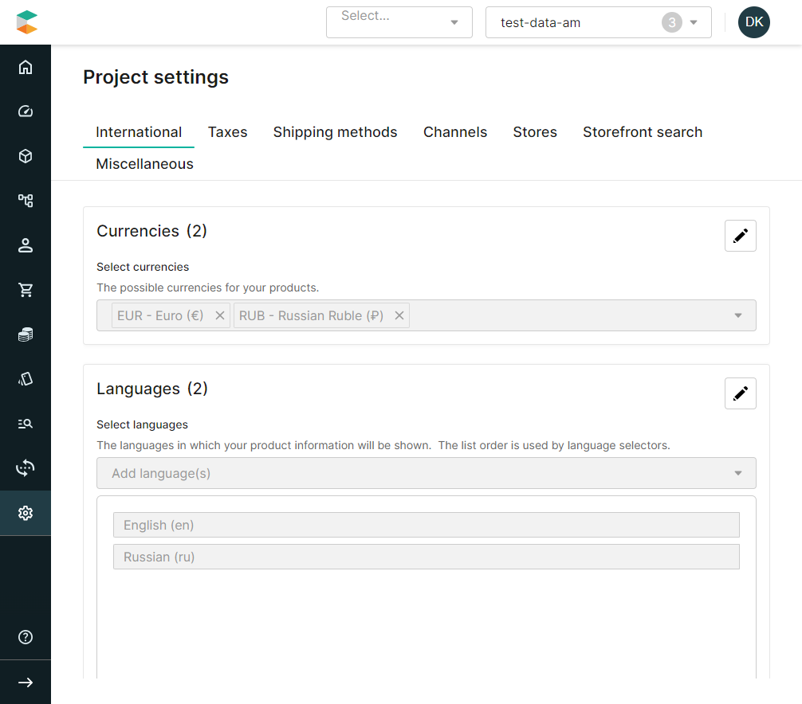
Set:
 - languages: `en`, `ru`;
 - countries: `ru`;
 - currencies: `RUB`;

Go tab page `Storefront search` and toggle `Indexing` to `active` 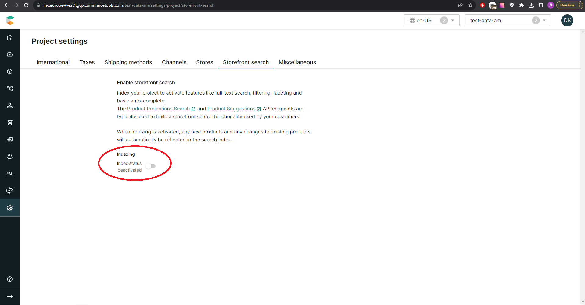

## Create Tax

At the moment there no `command` to save all project objects. You need to create a `Tax category` to correct work of add to basket.

Go tab page `Taxes` on `Project settings`
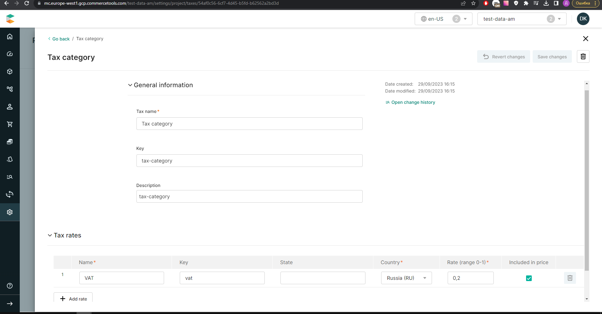

## Create API Client
>**NOTE:**
>After creating the Api-Client save client credentionals as `.env` file and replace values `CTP_PROJECT_KEY`, `CTP_CLIENT_SECRET`, `CTP_CLIENT_ID` in enum `APICredentials`

https://github.com/spacehummer/eCommerce-Application/blob/c8b469784d48e68104d71624dca68503c1aa7965/src/api/utils/apiCredencials.ts#L1-L4

>by new values from `.env` file.

Go `Developer settings` and create `API client` using presets for `Mobile&SPA` 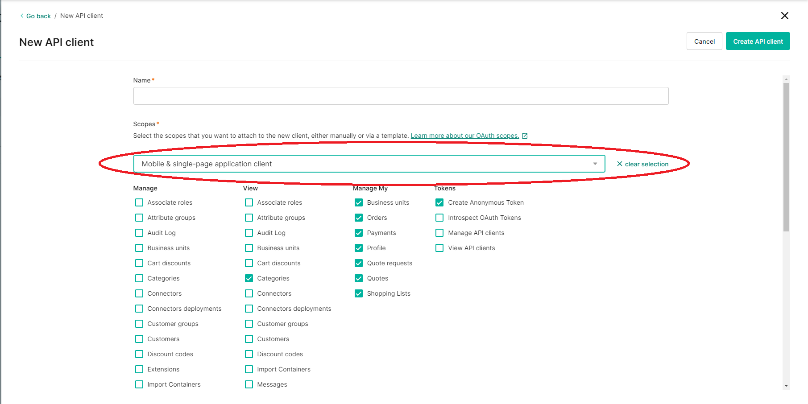

## Commands sequence

> **NOTE:** fill in all fields as indicated in all screenshots.

After configure project settings go [ImpEx (A GUI application to run command-line processes)](https://impex.europe-west1.gcp.commercetools.com/) to run commands
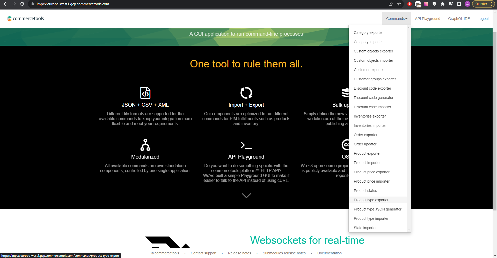

**Select command:**
 - `Category importer`. file to upload [exported-categories_en_slug.csv](./assets/data-files/category/exported-categories_en_slug.csv)
 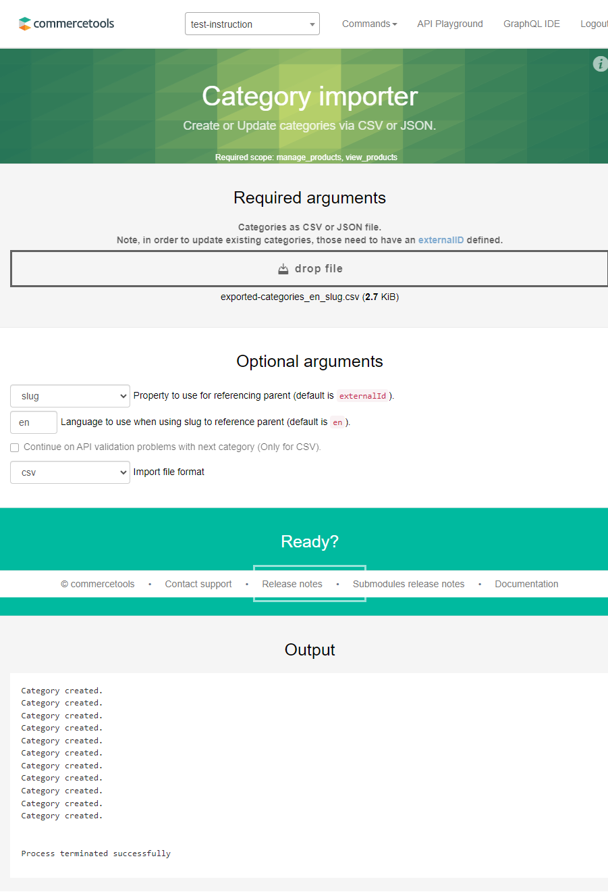

 - `Product type import`. Files to upload `product types`: [products-to-attributes.csv](./assets/data-files/product-types/products-to-attributes.csv); `attributes`: [attributes.csv](./assets/data-files/product-types/attributes.csv)
 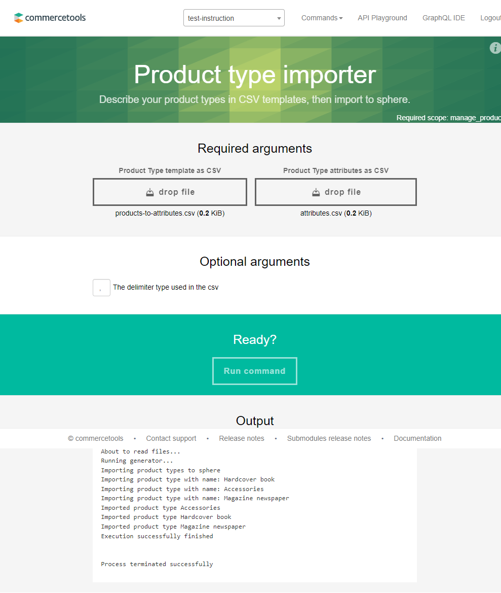

 - `Product importer`. Files to upload (one per `product-type`): [Accessories.csv](./assets/data-files/product/Accessories.csv), [Hardcover-book.csv](./assets/data-files/product/Hardcover-book.csv), [Magazine-newspaper.csv](./assets/data-files/product/Magazine-newspaper.csv)
 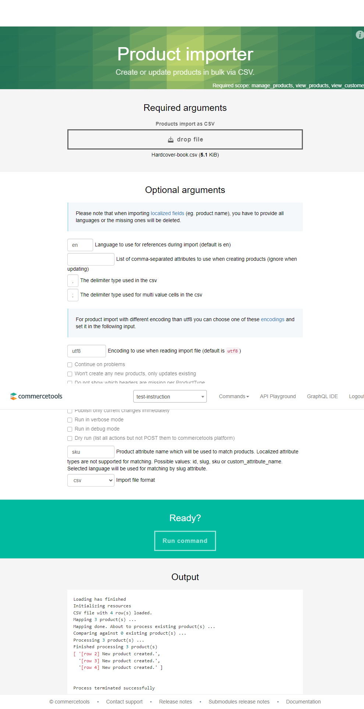

 ## Publich products 

Go to `Products list` in `Merchant Center`
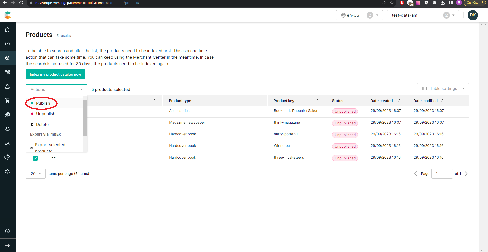

## Create a discount code for basket
> **NOTE:** don't forget to toogle `active` when create new discounts
1) Go discounts to create a discount code:
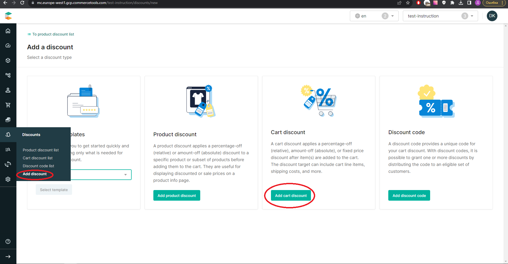
2) Create a discount:
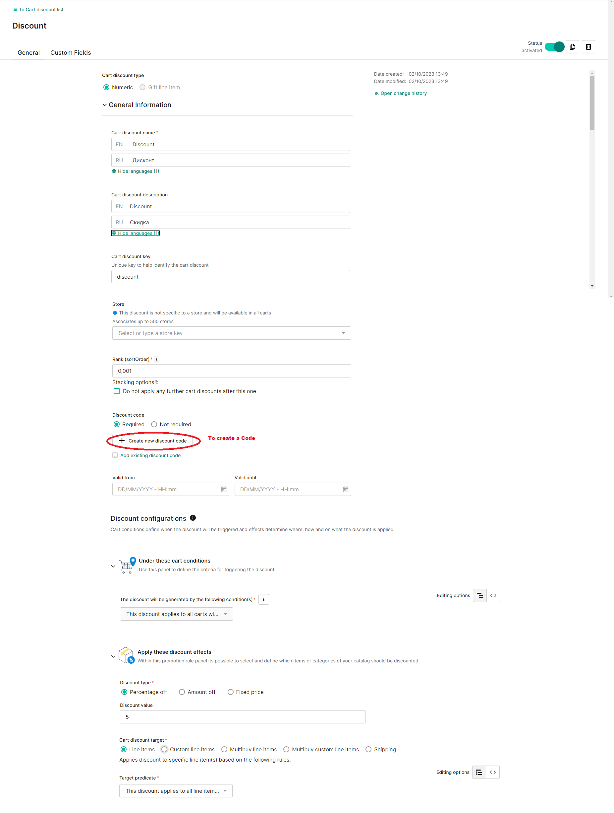
3) Add a code:
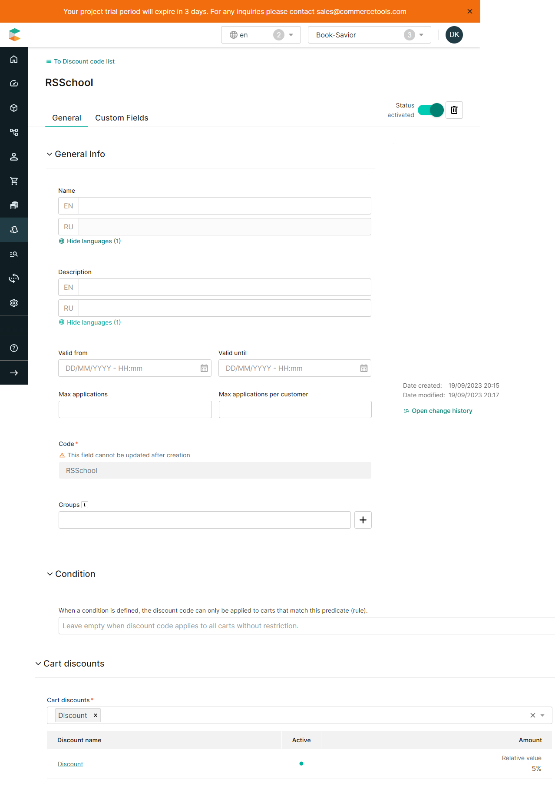